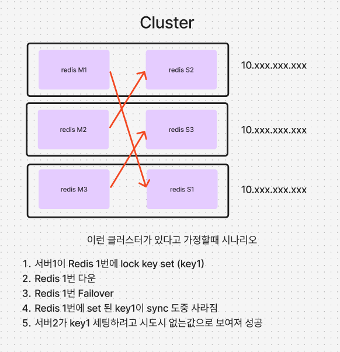
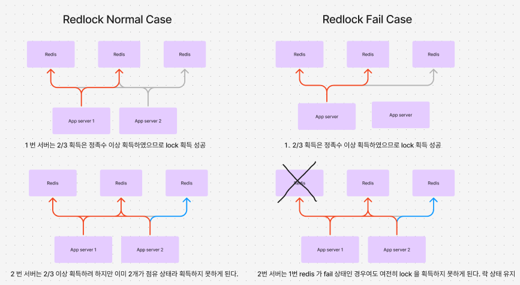

# Redis Lock 알고리즘에 대해서 간단하게 알아보자

### Why?

내가 생각하는 레드락 알고리즘의 사용은 replica 할 때 싱크가 안맞다 발생하는 문제를 줄이기 위해서 사용한다.
다음 예시를 살펴보자

이 예제애서 보면 알 수 있듯이 확률은 희박하지만 중복 실행의 여지가 있다. 이를 방지하게 위해서 나온것이 Red lock

#### 그렇다면 Red lock 은 이를 어떻게 방지할까?

red lock 은 위와 같이 하나의 노드가 다운되는 상황에서도 잘 작동함을 보장한다.
이 말은 노드 다운이 중복실행으로 이어지지 않는다는 말이다.